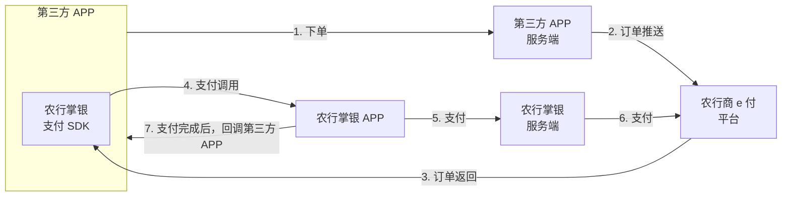

# jkr-abc-epay

农行e支付鸿蒙SDK封装插件，支持农行掌银支付功能。

## 功能特性

- 支持农行掌银支付（含中间页面）
- 支持农行掌银支付（不含中间页面）
- 检查农行APP安装状态（使用鸿蒙原生API）
- 完整的错误处理机制

## 平台支持

- 鸿蒙 (HarmonyOS)

## 安装

将插件放入项目的 `uni_modules` 目录下。

## 前置条件

1. 已成为农行线上支付平台（商e付）的签约商户
2. 应用服务端已对接农行商e付测试环境
3. 已将APP包名添加至农行掌银白名单
4. **重要**：需要在 `harmony-configs/entry/src/main/module.json5` 中配置 `querySchemes`

## 配置说明

### 1. 配置 querySchemes（必须）

插件已在 `harmony-configs/entry/src/main/module.json5` 中配置了 `querySchemes: ["bankabc"]`，用于检查农行APP安装状态。

如果项目中没有此文件，请在 `harmony-configs/entry/src/main/module.json5` 中添加以下配置：

```json5
{
  "module": {
    // ... 其他配置
    "querySchemes": [
      "bankabc"
    ]
  }
}
```

**注意**：`querySchemes` 只允许在 `entry` 类型的模块中配置，不能在 `har` 模块中配置。

## 使用方法

**重要**：此插件仅支持鸿蒙平台，使用时必须添加条件编译指令。

### 1. 调起支付（含中间页面）

```typescript
// #ifdef APP-HARMONY
import { callPay } from "@/uni_modules/jkr-abc-epay"
// #endif

// 在方法中调用
function handlePay() {
  // #ifdef APP-HARMONY
  callPay({
    url: "http://10.230.132.250:8530/mpay/?TOKEN=***    isRelease: false, // 测试环境
    success: (res) => {
      console.log("支付成功:", res.message)
      // 处理支付成功逻辑
    },
    fail: (err) => {
      console.error("支付失败:", err.errMsg)
      // 处理支付失败逻辑
    },
    complete: (res) => {
      console.log("支付完成:", res)
    }
  })
  // #endif
}
```

### 2. 调起支付（不含中间页面）

```typescript
// #ifdef APP-HARMONY
import { startBankABC } from "@/uni_modules/jkr-abc-epay"
// #endif

function handlePayByToken() {
  // #ifdef APP-HARMONY
  startBankABC({
    method: "pay",
    token: "1111111111111", // 订单号
    isRelease: false, // 测试环境
    success: (res) => {
      console.log("支付成功:", res.message)
    },
    fail: (err) => {
      console.error("支付失败:", err.errMsg)
    },
    complete: (res) => {
      console.log("支付完成:", res)
    }
  })
  // #endif
}
```

### 3. 检查农行APP安装状态

```typescript
// #ifdef APP-HARMONY
import { checkInstall } from "@/uni_modules/jkr-abc-epay"
// #endif

function checkAbcApp() {
  // #ifdef APP-HARMONY
  const isInstalled = checkInstall()
  if (isInstalled) {
    console.log("农行APP已安装")
    // 继续支付流程
  } else {
    console.log("农行APP未安装")
    // 提示用户安装农行APP
  }
  // #endif
}
```

## API 参考

### callPay(options)

调起农行支付（含中间页面）

#### 参数

| 参数 | 类型 | 必填 | 说明 |
|------|------|------|------|
| url | string | 是 | 支付链接地址 |
| isRelease | boolean | 否 | 是否是生产环境，默认false |
| success | function | 否 | 支付成功回调 |
| fail | function | 否 | 支付失败回调 |
| complete | function | 否 | 完成回调（成功/失败都会调用） |

### startBankABC(options)

调起农行支付（不含中间页面）

#### 参数

| 参数 | 类型 | 必填 | 说明 |
|------|------|------|------|
| method | string | 是 | 支付方式 |
| token | string | 是 | 订单号 |
| isRelease | boolean | 否 | 是否是生产环境，默认false |
| success | function | 否 | 支付成功回调 |
| fail | function | 否 | 支付失败回调 |
| complete | function | 否 | 完成回调（成功/失败都会调用） |

### checkInstall()

检查农行APP是否已安装

#### 返回值

| 类型 | 说明 |
|------|------|
| boolean | 是否已安装 |

#### 实现说明

该方法使用鸿蒙原生API `bundleManager.canOpenLink` 来检查农行APP是否安装：
- 通过检查农行APP的URL scheme `bankabc://` 来判断应用是否可访问
- **需要在 `harmony-configs/entry/src/main/module.json5` 中配置 `querySchemes: ["bankabc"]`**
- 仅返回是否安装，不包含版本信息（canOpenLink API 不提供版本号）

## 错误码

| 错误码 | 说明 |
|--------|------|
| 9010001 | 支付链接无效 |
| 9010002 | 农行APP未安装 |
| 9010003 | 支付失败 |
| 9010004 | 支付取消 |
| 9010005 | 网络错误 |
| 9010006 | 参数错误 |

## 支付流程说明



## 注意事项

1. **条件编译**：此插件仅支持鸿蒙平台，使用时必须添加 `// #ifdef APP-HARMONY` 条件编译指令
2. **白名单配置**：第三方APP需提供包名给农行业务部门添加至掌银白名单
3. **环境配置**：测试环境和生产环境使用不同的支付链接
4. **错误处理**：建议实现完整的错误处理逻辑，包括用户取消支付的情况
5. **依赖配置**：确保 `config.json` 中正确配置了 `ABCEPay.har` 依赖
6. **querySchemes配置**：插件已在 `harmony-configs/entry/src/main/module.json5` 中配置了 `querySchemes: ["bankabc"]`，确保此文件存在

## 示例项目

参考项目中的示例代码了解完整使用方式。

## 版本历史

### 1.0.3
- 简化 `checkInstall` 方法返回值，直接返回 `boolean`
- 移除不必要的 `ABCEPayCheckInstallResult` 类型定义
- 补充条件编译说明

### 1.0.2
- 修复 ArkTS 类型错误，遵循 UTS 与 ArkTS 对象映射规范
  - 将 `undefined` 替换为 `null`（鸿蒙平台使用 `null` 表示空值）
  - 将可选属性改为 `type | null` 形式（如 `orderId: string | null`）
  - 确保所有类型定义符合 ArkTS 编译要求

### 1.0.1
- 修复 `module.json5` 配置错误，移除 `querySchemes` 配置
- 将 `querySchemes` 配置移到 `harmony-configs/entry/src/main/module.json5` 中

### 1.0.0
- 初始版本
- 支持农行掌银支付（含/不含中间页面）
- 支持检查农行APP安装状态（使用鸿蒙原生API）
- 完整的错误处理机制